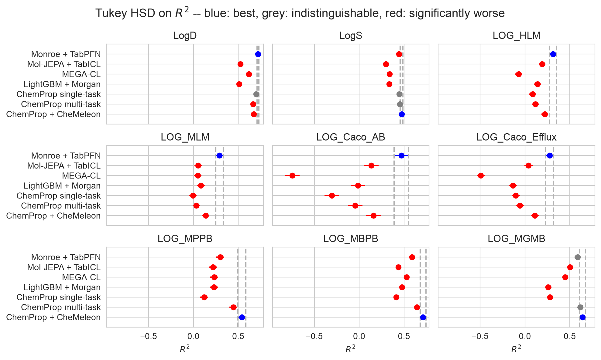
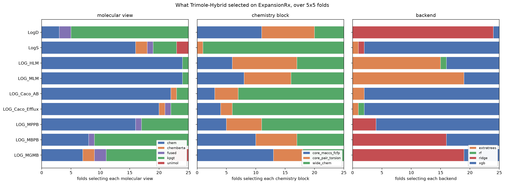

# expansion-ml-comparison

Seven machine learning methods, fifteen ADME and physicochemical endpoints
across two unrelated data sets, 25 replicate models each, every one scored on a
held-out test set it never saw.

Four of the seven are pre-trained foundation models, and only two of those four
win anything at all. The method that wins most does no downstream training
whatsoever. It freezes a pre-trained encoder and predicts each endpoint in
context.

A plain graph network is not reliably better than a fingerprint baseline either.
What makes it win is pre-training or multi-task transfer.

The second data set is there because a comparison run once is a hypothesis. The
headline survives it. The most interesting pattern in the first data set does
not.

Two reports come out of this directory: the seven-method comparison, at
[docs/reports/expansion-ml-comparison.html](../../docs/reports/expansion-ml-comparison.html)
or on the [web](https://patwalters.github.io/model-validation-central/reports/expansion-ml-comparison.html), and the Trimole-Hybrid
comparison described further down, at
[docs/reports/trimole-hybrid.html](../../docs/reports/trimole-hybrid.html)
or on the [web](https://patwalters.github.io/model-validation-central/reports/trimole-hybrid.html).



Each bar is one method's mean over 25 folds, with a confidence interval widened
to cover every pairwise comparison at once. Blue is the best mean, and the dashed
lines mark its interval. Grey overlaps the blue interval, so the difference does
not survive the correction. Red clears it and is worse. Overlapping bars mean
what they look like they mean, which is the point of correcting first.

The bar colours and the `best` / `tied` / `worse` chips in the tables come from
two different rules. The plot asks whether a method's interval overlaps the
reference method's. The chips read the pairwise `reject` flag. The two agree
exactly when every method contributes the same number of folds, and they can
drift apart when it does not. `make_tukey_plot` refuses to draw an unbalanced
panel for that reason.

## What was compared

| Method | Description | Tasks |
| --- | --- | --- |
| `lgbm` | LightGBM on Morgan count fingerprints, radius 2, 2048 bits | one model per endpoint |
| `chemprop_st` | ChemProp D-MPNN trained from scratch | one model per endpoint |
| `chemprop` | the same D-MPNN, trained from scratch | one model per assay family |
| `chemeleon` | the same D-MPNN, message passing initialised from CheMeleon | one model per assay family |
| `megacl` | MEGA-CL, fine-tuned from the authors' pre-trained checkpoint | one model per endpoint |
| `monroe` | Monroe's frozen encoder plus TabPFN, no downstream training | one in-context fit per endpoint |
| `moljepa` | Mol-JEPA's frozen multimodal encoder plus TabICL, likewise | one in-context fit per endpoint |

The three assay families are physicochemical and tissue binding (LogD, LogS,
MPPB, MBPB, MGMB), microsomal stability (HLM, MLM), and Caco-2 permeability
(Papp A to B, efflux ratio).

## Headline result

Tukey HSD over 25 folds, counted across every endpoint and metric combination.
Twenty-seven combinations on the ExpansionRx set, from nine endpoints and three
metrics.

Where two methods cannot be separated, both are counted as tied. Calling the one
with the higher mean the winner would be the bold-maximum habit in a different
costume.

| Method | Best alone | Tied for best | Worse |
| --- | ---: | ---: | ---: |
| Monroe + TabPFN | 12 | 6 | 9 |
| ChemProp + CheMeleon | 7 | 5 | 15 |
| ChemProp single-task | 0 | 4 | 23 |
| ChemProp multi-task | 0 | 4 | 23 |
| LightGBM + Morgan | 0 | 0 | 27 |
| MEGA-CL | 0 | 0 | 27 |
| Mol-JEPA + TabICL | 0 | 0 | 27 |

Nineteen of the 27 combinations have a single method at the top. The other eight
have two or three that cannot be told apart. Monroe is at the top of 18 of them
and CheMeleon 12, and nothing else is ever at the top.

The split between those two follows the assay, not the amount of data. Monroe
leads on LogD, both microsomal stability endpoints, and both Caco-2 endpoints.
CheMeleon leads on all three tissue binding endpoints, plus LogS. Caco-2 is the
widest gap. Monroe reaches R squared 0.471 on permeability where nothing else
clears 0.16, and it wins all 25 folds on all three metrics.

The exception is worth more than the tally. On LogD, the endpoint with the most
measurements, single-task ChemProp shares the top with Monroe on all three
metrics. Given enough data, the model learns a representation as good as the one
it would have been handed.

MEGA-CL and Mol-JEPA are best on nothing and tied with the best on nothing, and
both are pre-trained foundation models. The benefit belongs to a particular
pre-trained model, not to pre-training as an idea.

For Mol-JEPA the head is not the explanation. Running the same frozen embeddings
through TabPFN instead of TabICL moves it by 0.013 R squared, against a 0.18 gap
to Monroe. The difference is the representation.

### And on the Biogen set

Eighteen combinations, from six endpoints and three metrics.

| Method | Best alone | Tied for best | Worse |
| --- | ---: | ---: | ---: |
| Monroe + TabPFN | 18 | 0 | 0 |
| every other method | 0 | 0 | 18 |

Monroe takes all eighteen. Nothing else is best on one, and nothing else is even
tied with the best on one. Against CheMeleon it wins 450 folds out of 450.

The assay split does not replicate. On ExpansionRx, CheMeleon took the three
tissue binding endpoints. Biogen's two plasma protein binding endpoints are
where it should have been strong, and they are where it loses worst, R squared
0.478 against 0.230 on human and 0.415 against 0.154 on rat.

What shows through instead is data volume. Mol-JEPA, best at nothing on
ExpansionRx, beats CheMeleon on the three Biogen endpoints with the least data
and loses to it on the three with the most. In-context prediction from a frozen
encoder degrades gently as labels run out. Fine-tuning does not. On the two
endpoints with about 120 training molecules, single-task ChemProp scores R
squared of -0.064 and -0.005, worse than predicting the training mean, and
MEGA-CL scores -0.292 and -0.426.

Three things carry across both sets. Monroe is the most accurate and the least
variable. MEGA-CL is the worst. And a from-scratch D-MPNN is still not reliably
better than a fingerprint baseline.

## Evaluation protocol

The `ds` column of the data file fixes a train and test split. The 25 replicates
come from five repeats of a five-fold `GroupKFold` over the training molecules,
grouped by `cluster`. Each fold fits on four fifths of the training set,
early-stops on the held-out fifth where there is a training loop to stop, and is
scored on the same untouched test set. LightGBM, Monroe, and Mol-JEPA have no
early stopping to do, so they use the four fifths and ignore the rest.

Every method sees identical training molecules in every fold. A difference in
the metrics is a difference in the method.

Statistics follow the approach in [Even More Thoughts on ML Method
Comparisons](https://practicalcheminformatics.blogspot.com/2025/03/even-more-thoughts-on-ml-method.html).
Fold-level distributions, Tukey HSD corrected for multiple comparisons, and
paired tests using the folds as the pairing. There are no bold maxima.

## Data

Two collections. Which one a script works on is read from `ADME_DATASET`, which
defaults to `expansion`. Every path is namespaced by it, so the two never write
into each other's folds, predictions, or results.

```bash
python 02_run_lightgbm.py                      # ExpansionRx
ADME_DATASET=biogen python 02_run_lightgbm.py  # Biogen
```

### ExpansionRx

`expansion_log_scaled.csv` holds 7,608 molecules, 5,326 train and 2,282 test.

The measurements come from the [OpenADMET-ExpansionRx Blind
Challenge](https://huggingface.co/datasets/openadmet/openadmet-expansionrx-challenge-data),
contributed by Expansion Therapeutics and released by OpenADMET under CC BY 4.0.
The molecules come from real drug discovery campaigns on RNA-mediated diseases.

Two changes were made to the released data.

1. Every endpoint was put on a `log10(x + 1)` scale. `LogD` is already a log
   quantity and was passed through unchanged. `LogS` and `LOG_Caco_AB` carry a
   further `-6`, which moves them from µM and 10⁻⁶ cm/s into molar and cm/s.
   That shift is a constant and cancels in MAE, R² and Spearman ρ.

   The `+1` is there because six of the nine endpoints report zeros, which
   plain `log10` cannot take. There are 179 of them in `LOG_HLM`, 156 in
   `LOG_MLM`, and fewer than a dozen apiece in the other four.

   Read MAE with the `+1` in mind. The transform is nearly linear below x = 1
   and only properly logarithmic above about x = 10, and a lot of this data sits
   in the flat part, from 3% of MLM values below 1 up to 22% of MBPB. A
   five-fold difference in free fraction is worth 0.67 units between 10% and 50%
   unbound, but only 0.14 units between 0.1% and 0.5%. All five methods share
   the target, so the comparison is unaffected, but an MAE of 0.175 is not a
   clean 1.5-fold error.
2. A `cluster` column was added, giving 651 chemical clusters.

The clusters group the cross-validation folds so that no molecule family
straddles the fit and validation boundary. They come from BitBIRCH-Lean at its
default settings. The threshold is estimated from the data rather than chosen by
hand. `00_cluster.py --check` recomputes the labels from the SMILES and confirms
they match the stored column, adjusted Rand index 1.0.

| Column | Meaning | Units before the log transform |
| --- | --- | --- |
| `LogD` | distribution coefficient | already log scale |
| `LogS` | kinetic aqueous solubility (KSOL) | µM |
| `LOG_HLM` | human liver microsomal CLint | mL/min/kg |
| `LOG_MLM` | mouse liver microsomal CLint | mL/min/kg |
| `LOG_Caco_AB` | Caco-2 permeability, apical to basolateral | 10⁻⁶ cm/s |
| `LOG_Caco_Efflux` | Caco-2 efflux ratio | unitless |
| `LOG_MPPB` | mouse plasma protein binding | percent unbound |
| `LOG_MBPB` | mouse brain protein binding | percent unbound |
| `LOG_MGMB` | mouse gastrocnemius muscle binding | percent unbound |

Endpoint columns are sparse. Each one is populated only for the molecules that
have a measurement for that assay, from 431 rows for `LOG_MGMB` up to 7,309 for
`LogD`.

## Reproducing the analysis

### From the stored predictions, about a minute

Every prediction from all 2,175 fold models is kept, 2,483,250 rows across the
two `results/<dataset>/predictions_all.parquet` files. The figures, tables, and
report rebuild from them without retraining anything.

```bash
pip install -r requirements.txt
for ds in expansion biogen; do
  ADME_DATASET=$ds python 04_collect_metrics.py        # -> fold_metrics.csv
  ADME_DATASET=$ds python 05_report.py                 # Tukey, paired, boxplots
  ADME_DATASET=$ds python 07_spearman_table_image.py --all
done
python 06_build_page.py          # results/report.html, both sets on one page
```

The second report is built the same way, with `ADME_COMPARISON` selecting which
methods appear. It reads the same `fold_metrics.csv`, so nothing is recomputed.

```bash
for ds in expansion biogen; do
  ADME_COMPARISON=trimole ADME_DATASET=$ds python 05_report.py
  ADME_COMPARISON=trimole ADME_DATASET=$ds python 13_trimole_selection.py
done
python 14_build_trimole_page.py  # results/trimole_report.html
```

### From scratch

The Biogen table has to be built once before its arms can run.

```bash
ADME_DATASET=biogen python 00b_prepare_biogen.py --download
```

Then, for either data set, with `ADME_DATASET` set accordingly:

```bash
python 00_cluster.py --check                    # ExpansionRx only
python 01_make_folds.py                         # multi-task fold files
python 01b_make_single_task_folds.py            # single-task fold files
python 02_run_lightgbm.py                       # minutes
python 03_run_chemprop.py --variant chemprop    # one variant at a time
python 03_run_chemprop.py --variant chemprop_st
python 03_run_chemprop.py --variant chemeleon
python 08_run_megacl.py                         # the long one, see below
python 09_run_monroe.py --embed                 # embed every molecule once
python 09_run_monroe.py                         # in-context fits
python 10_run_moljepa.py --embed
python 10_run_moljepa.py
```

A single-task arm fits one model per endpoint per fold, so 225 on ExpansionRx
and 150 on Biogen. The two multi-task ChemProp arms fit one per assay family per
fold, 75 on either set. That is 1,275 fold models for ExpansionRx and 900 for
Biogen.

Each script skips any fold whose prediction file already exists, so all of them
can be stopped and restarted. Use `--endpoint`, `--repeat`, and `--fold` to run
a subset.

`03_run_chemprop.py` shells out to the `chemprop` console script, so that has to
be on `PATH`. Calling the environment's Python by absolute path is not enough
and fails with `FileNotFoundError: 'chemprop'`.

Timings are from an M-series Mac for LightGBM and the two from-scratch ChemProp
arms, and from an RTX 5070 Ti for the rest. On Biogen, Monroe and Mol-JEPA each
embed all 3,521 molecules in about 10 seconds and finish their 150 folds in
under 5 minutes. CheMeleon took 2 hours 20 for its 75 folds and MEGA-CL roughly
7 hours for its 150. Run the GPU arms one at a time. Running two at once starved
the smaller of them almost completely, one fold in the time it had been taking
twelve.

### Biogen ADME

`biogen_adme_3521.csv` holds 3,521 molecules, 2,463 train and 1,058 test, on six
endpoints.

The measurements come from
[molecularinformatics/Computational-ADME](https://github.com/molecularinformatics/Computational-ADME),
released by Biogen under the MIT License with the paper of Fang et al. The
values arrive already log transformed and nothing was done to them.

`00b_prepare_biogen.py` adds the two columns the pipeline needs. Column names
are shortened to match the style of the other set, `LOG_HLM` deliberately being
the same name in both because it is the same assay.

1. `cluster`, from BitBIRCH-Lean, exactly as for the other set. The 3,521
   molecules give 1,905 clusters with 1,123 singletons. That is a far more
   diverse collection than ExpansionRx, which gives 651 clusters and 170
   singletons from 7,608 molecules, and it means `GroupKFold` is closer to a
   random split here.
2. `ds`, a fixed train/test split, which the file does not carry. Whole clusters
   are held out in a seeded order until the test set reaches the same 30% the
   ExpansionRx file uses.

Two things to know before reading the numbers.

- The Biogen holdout is cluster-pure by construction. The ExpansionRx one
  arrived with the challenge and is not, since 59 of its 651 clusters straddle
  the boundary. Biogen is the harder test, so absolute numbers do not transfer
  between the two. Rankings within each do.
- 31% of the HLM values and 11% of the RLM values sit exactly on the assay
  floor, stacked on one number because the compound was too stable to measure.
  A large block of ties is easy to order, so that flatters Spearman rho.

The repository also ships 80/20 splits under `MPNN/`. They are not used here.
They are per-endpoint rather than global, which a multi-task model cannot
consume, and the two plasma protein binding splits hold about nine times more
molecules than the public file does, drawn from in-house data that was never
released. Only 194 and 168 of those measurements are public, which is why those
two endpoints have 128 and 109 training molecules here.

| Column | Meaning | Units |
| --- | --- | --- |
| `LOG_SOL` | solubility at pH 6.8 | log µg/mL |
| `LOG_HLM` | human liver microsomal CLint | log mL/min/kg |
| `LOG_RLM` | rat liver microsomal CLint | log mL/min/kg |
| `LOG_MDR1_ER` | MDR1-MDCK efflux ratio | log B-A/A-B |
| `LOG_HPPB` | human plasma protein binding | log % unbound |
| `LOG_RPPB` | rat plasma protein binding | log % unbound |

## Reproducing the MEGA-CL arm

`08_run_megacl.py` does not vendor MEGA-CL. Clone
[KeduJin/MEGA-CL](https://github.com/KeduJin/MEGA-CL), which now ships
`checkpoints/model_best.pth`, and point `MEGACL_HOME` at it.

```bash
export MEGACL_HOME=~/software/MEGA-CL
python 08_run_megacl.py --gpu 0
```

The script keeps the authors' trainer, optimizer, 100-epoch schedule, and
best-validation checkpoint selection. Only the split is overridden, so MEGA-CL
reads the same folds as everything else. It asserts on every run that 121 of the
129 checkpoint tensors load. `strict=False` would otherwise turn the arm into the
same architecture trained from scratch, without saying so.

This arm needs CUDA and took 21 hours 32 minutes on an RTX 5070 Ti. Running
several fine-tuning processes at once made it slower, not faster. The model is
small enough to be launch-latency bound, and without CUDA MPS the processes
time-slice the GPU. One process at a time is the right call.

### Reproducing the Monroe arm

`09_run_monroe.py` does not vendor Monroe. Clone
[blazejba/monroe](https://github.com/blazejba/monroe), which ships the
pre-trained encoder in `checkpoint/` through Git LFS, and point `MONROE_HOME` at
it.

```bash
export MONROE_HOME=~/software/monroe
export TABPFN_TOKEN=...                # see below
python 09_run_monroe.py --embed
python 09_run_monroe.py
```

The encoder is never updated. `--embed` featurizes every molecule once, RDKit
ETKDG conformer and all, and caches one 720-d vector per molecule in
`data/<dataset>/monroe_embeddings.npz`. All 7,608 molecules took 32 seconds on an RTX 5070
Ti. Each fold then hands TabPFN the training embeddings with their labels and
reads the test predictions out of one forward pass. All 225 folds took 14
minutes.

The downstream head is the authors' `fit_predict_tabpfn` at their default
ensemble settings. The one choice made here is `output_type="mean"`, TabPFN's
default and the one their own OpenADMET example uses. Their benchmark code
switches to `"median"` for tasks scored by MAE, which is right when MAE is the
only metric. Here one set of predictions has to serve R squared, Spearman, and
MAE together.

TabPFN v3 weights are licence gated. Register at
[ux.priorlabs.ai](https://ux.priorlabs.ai), accept the `tabpfn-3` licence on the
Licenses tab, and put the API key in `TABPFN_TOKEN`. TabPFN v2 is not a
substitute. It caps at 500 features and Monroe hands it 720.

Monroe cannot have seen these labels. It pre-trains on 1,152 named tasks: 62
graph-level semi-empirical quantum properties from PM6, 1,089 binary PubChem
bioassay calls from PCBA, and one conformer denoising objective. PM6 is computed
chemistry and PCBA is screening activity. Neither carries an ADME measurement,
so nothing scored here reached the model as a training label, on either data
set. Molecules are a separate question from labels, and that overlap has been
counted. Blazej Banaszewski, one of Monroe's authors, checked both test sets
against the pre-training corpora and found no label overlap. One ExpansionRx
test molecule, carrying LogD and LogS, is in PM6. On the Biogen side about 53%
of the test molecules are in PM6 and about 8% in PCBA, which is a great deal of
structural overlap carrying none of these measurements. PM6 contributes
quantum-chemical descriptors unrelated to these assays, and the PCBA bioassays
nearest the Biogen endpoints are still different experiments reporting different
labels.

One thing is still worth recording. Monroe's authors have run their model on
this data set. Their repository ships a notebook that predicts the untransformed
ExpansionRx measurements and compares the result against OpenADMET's CheMeleon
baseline. The folds, the transform, and the test set here are ours, and no
Monroe hyperparameter was tuned on them.

### Reproducing the Mol-JEPA arm

`10_run_moljepa.py` pulls the checkpoint from HuggingFace on first use. It ships
custom modeling code, so `trust_remote_code=True` is required. The weights are
released under CC BY-NC 4.0, which is more restrictive than the rest of this
repository.

```bash
python 10_run_moljepa.py --embed
python 10_run_moljepa.py                 # TabICL, the arm in the report
python 10_run_moljepa.py --head tabpfn   # the control, see below
```

Pin `transformers` below 5. Under transformers 5 the model is built on the meta
device and its Epps-Pulley buffer construction fails with a device mismatch. The
environment used was Python 3.12 with torch 2.9.1+cu130, torch-geometric,
transformers 4.57.6, rdkit, molfeat, tabicl 2.1.1, and tabpfn 8.3.0.

Inference needs only SMILES. The fourteen modalities are a pretraining-time
concern, and none of them, including the commercial MOE descriptors, is required
to embed a new molecule. All 7,608 molecules took 16 seconds on an RTX 5070 Ti.
The 512-d CLS token is cached in `data/<dataset>/moljepa_embeddings.npz`.

TabICL is the head the authors recommend on their model card, so it is the arm
that appears in the figures. The TabPFN head is a control that answers one
question, how much of the gap to Monroe is the representation and how much is
the predictor. Its predictions land in `results/<dataset>/sensitivity/`, deliberately
outside `predictions/`, so `04_collect_metrics.py` cannot sweep them into the
comparison as an eighth method.

### Checking Mol-JEPA's pre-training overlap

Mol-JEPA's authors evaluated on this data set too, and here label overlap is a
real question. Two of the fourteen modalities are experimental label vectors
from ChEMBL, PCBA, and TDC, and TDC does carry ADME tasks. The authors released
the whole pre-training table, so the overlap can be measured rather than
assumed.

```bash
curl -L -o metadata.csv https://huggingface.co/datasets/Flogrammer/Mol-JEPA-dataset/resolve/main/metadata.csv
python 11_check_pretraining_overlap.py metadata.csv
```

Across all 4,663,780 rows there are no exact InChIKey matches to our 7,608
molecules. Two rows share a connectivity block with one of ours, both from PCBA,
and neither carries an ADME measurement. The table has columns named for the
nine ExpansionRx endpoints, and every one of them is empty in all 4.66 million
rows. The download is about 2 GB and the scan takes a couple of minutes.

## The second comparison: Trimole-Hybrid

Everything above compares architectures. Trimole-Hybrid asks a different
question, so it gets its own report rather than an eighth column on the first
one.

It is not a model. It is a selection procedure. For each endpoint and each fold
it builds sixty candidate predictors, fits all of them on the training
molecules, scores them on the held-out validation fifth, and keeps exactly one
to predict the test set. The candidates are five molecular views crossed with
three blocks of chemistry priors crossed with four backends.

| Method | Description | Tasks |
| --- | --- | --- |
| `trimole` | 60 candidates per fold, selected on validation only | one selection per endpoint |

The four baselines it is put against are `lgbm`, `chemprop_st`, `chemprop` and
`chemeleon`, which between them cover a fingerprint model, a single-task GNN, a
multitask GNN and a foundation-initialised GNN.

### Headline result

It loses, on both data sets, to a single well-initialised graph network.

Counting every endpoint x metric combination, and calling a method "on top" when
Tukey HSD cannot separate it from the leader:

| Method | ExpansionRx, of 27 | Biogen, of 18 |
| --- | --- | --- |
| `chemeleon` | 9 alone, 16 tied | 10 alone, 4 tied |
| `trimole` | 2 alone, 9 tied | 4 alone, 2 tied |
| `chemprop` | 0 alone, 5 tied | 0 alone, 2 tied |
| `chemprop_st` | 0 alone, 4 tied | 0 alone, 2 tied |
| `lgbm` | 0 alone, 0 tied | 0 alone, 0 tied |

Head to head over paired folds, CheMeleon takes seven of nine ExpansionRx
endpoints and four of six Biogen ones. Trimole-Hybrid is not last. It beats
LightGBM everywhere and beats both from-scratch ChemProp variants on the tally.
The selection buys something, just less than a good initialisation does.

Two things explain the gap, and both are only visible in what it selected.

**Nothing in the pool learns a representation.** Every candidate is a frozen
encoder or a block of classical descriptors handed to a tree ensemble or a
ridge. On LogD, the endpoint with the most training data, single-task ChemProp
reaches R² 0.700 and Trimole-Hybrid reaches 0.399, behind even LightGBM at
0.510. Where there is enough data to learn a representation, a network that
learns one wins, and choosing among fixed alternatives does not close it.

**Selecting on validation only helps if validation resembles the test set.**
Every selection record stores what the winning candidate scored on validation,
and the fold metrics store what it then achieved:

| Data set | Gap between the winner's validation R² and its test R² |
| --- | --- |
| ExpansionRx | +0.16 to +0.47 across all nine endpoints |
| Biogen, four well-populated endpoints | +0.03 to +0.05 |
| Biogen, two endpoints with ~22 validation molecules | +0.23, +0.25 |

Biogen's holdout was built here by holding out whole BitBIRCH clusters, the same
rule that builds the cross-validation folds, so validation and test are the same
kind of problem. The ExpansionRx split shipped with the challenge and was drawn
some other way, so they are not. That is a risk a selection framework carries and
a fixed architecture does not: CheMeleon never consults validation to decide what
it is.

What it chose is a result in its own right, and it does not replicate:

| View selected | ExpansionRx, of 225 | Biogen, of 150 |
| --- | --- | --- |
| chemistry priors alone | 140 | 50 |
| + KPGT | 66 | 61 |
| + all three | 8 | 19 |
| + ChemBERTa | 6 | 6 |
| + UniMol 3D | 5 | 14 |

On ExpansionRx the modal view holds 75% of an endpoint's folds; on Biogen, 53%.
The same procedure given different chemistry reaches for different evidence and
is less certain of it. Backends shift too: XGBoost wins 121 of 225 ExpansionRx
folds against ridge's 64, but 142 of 150 on Biogen. Random forest, one of the
four backends, wins twice in 375 folds.



### This arm is a reimplementation

The other pre-trained arms in this repository run their authors' code against
their authors' checkpoints. This one cannot. The public release says of itself
that it is "not a one-command full rerun bundle". Filesystem paths are
placeholders, no trained weights or cached embeddings are included, every script
is wired to the TDC benchmark's per-task directory layout, and
`LICENSE_PENDING.md` reserves all rights pending a licence decision, so none of
their source is vendored here.

`12_run_trimole.py` is therefore written from the paper and from that source
read as a specification, using checkpoints obtained independently from their
original authors. It reproduces the method, not the paper's numbers.

Two components are deliberately left out, both noted in the report. The learned
gated-fusion network is replaced by feature-level concatenation plus the
selection step, on the strength of the paper's own ablation, which found a naive
learned combiner did worse than task-wise selection on all 22 of its tasks. And
the pool omits the seed-bagging, rank-blending and top-k sweeps of the full
prediction zoo, which enlarge the pool without changing what it selects over.

### Reproducing the Trimole-Hybrid arm

Three of the four views are cached in about a minute on a GPU. The chemistry
priors are CPU work and can run at the same time, since they never touch the
card.

```bash
for ds in expansion biogen; do
  ADME_DATASET=$ds python 12_run_trimole.py --embed   # ChemBERTa + UniMol
  ADME_DATASET=$ds python 12_run_trimole.py --chem    # the chemistry priors
done
```

ChemBERTa comes from HuggingFace unauthenticated. UniMol arrives with
`unimol_tools` and downloads its own weights. The environment used was Python
3.11 with torch 2.9.1+cu130, transformers 5.16.1, xgboost 3.2.0, scikit-learn
1.7.2, rdkit 2025.09.1 and unimol-tools.

The KPGT view needs its own environment, because KPGT is built on DGL, whose
graphbolt library is compiled per torch version and stops at torch 2.2. Pin
`torch==2.2.1`, `dgl==2.1.0`, `torchdata==0.7.1`, and add `pandas_flavor` and
`pyyaml`, which the vendored descriptor code needs but does not declare. CPU is
fine: 7,608 molecules take 79 seconds.

Download the pre-trained checkpoint from the link in the
[KPGT README](https://github.com/lihan97/KPGT) (Apache-2.0) and unzip it so that
`base.pth` sits in `models/` beside the checkout.

```bash
KPGT_HOME=~/software/KPGT ADME_DATASET=expansion python 12b_extract_kpgt.py
KPGT_HOME=~/software/KPGT ADME_DATASET=biogen    python 12b_extract_kpgt.py
for ds in expansion biogen; do
  ADME_DATASET=$ds python 12_run_trimole.py --merge-kpgt
done
```

Then the folds. This arm is CPU bound rather than GPU bound, because the views
are cached up front and what remains is sixty tabular fits per fold, so it
parallelises across folds and will happily share a machine with a GPU job.

```bash
for ds in expansion biogen; do
  ADME_DATASET=$ds python 12_run_trimole.py --jobs 30 --threads 1
done
```

Set `OMP_NUM_THREADS=1` and friends *before* the interpreter starts. OpenBLAS
reads them when it initialises at numpy import, so setting them inside the
worker processes is too late and every worker quietly runs a multi-threaded BLAS
underneath thirty processes. Prefer more workers to more threads: scikit-learn's
loky backend refuses to thread inside a pool worker anyway.

The run is resumable. A fold is skipped only when both its prediction file and
its selection record exist, so a fold interrupted mid-write is recomputed rather
than half-trusted.

## Files

| Path | What it is |
| --- | --- |
| `config.py` | paths, columns, endpoint groups, method definitions, CV settings |
| `clustering.py` | BitBIRCH-Lean settings, shared by both data sets |
| `00_cluster.py` | recomputes the ExpansionRx `cluster` column from the SMILES |
| `00b_prepare_biogen.py` | builds `biogen_adme_3521.csv`, clusters and split included |
| `01_make_folds.py`, `01b_make_single_task_folds.py` | fold assignment and per-fold input files |
| `02_run_lightgbm.py` | the LightGBM arm |
| `03_run_chemprop.py` | the three ChemProp arms, including CheMeleon |
| `08_run_megacl.py` | the MEGA-CL arm |
| `09_run_monroe.py` | the Monroe arm, embedding cache and in-context fits |
| `10_run_moljepa.py` | the Mol-JEPA arm, both downstream heads |
| `11_check_pretraining_overlap.py` | joins this test set to Mol-JEPA's pre-training table |
| `04_collect_metrics.py` | predictions to per-fold R², Spearman ρ, and MAE |
| `12_run_trimole.py` | the Trimole-Hybrid arm, its four view caches and the per-fold selection |
| `12b_extract_kpgt.py` | KPGT graph features, in their own environment |
| `13_trimole_selection.py` | what the selection actually chose, as a table and a figure |
| `05_report.py` | Tukey plots, paired plots, boxplots, summary tables |
| `06_build_page.py` | the standalone HTML report |
| `14_build_trimole_page.py` | the second report, the Trimole-Hybrid comparison |
| `07_spearman_table_image.py` | metric tables as images |
| `page_kit.py` | stylesheet and page furniture shared by both reports |
| `model_comparison.py` | Tukey helpers |
| `PROMPTS.md` | the prompts this analysis was built from |
| `results/<dataset>/fold_metrics.csv` | 1,575 and 1,050 rows, one per endpoint, method, repeat, and fold |
| `results/<dataset>/predictions_all.parquet` | every retained prediction |
| `results/<dataset>/tables/` | summary and head-to-head tables |

Every script here was written by Claude Code from the 17 prompts in
[PROMPTS.md](PROMPTS.md). That file lists them in order, with what each one
changed.

`data/`, `folds/`, and `predictions/` are not tracked. They add up to roughly
350 MB and every one of them is rebuilt by the scripts above.

## References

1. Graff, D. E.; Morgan, N. K.; Burns, J. W.; et al. Chemprop v2: An Efficient,
   Modular Machine Learning Package for Chemical Property Prediction.
   *J. Chem. Inf. Model.* 2026, 66 (1), 28-33.
   [doi:10.1021/acs.jcim.5c02332](https://doi.org/10.1021/acs.jcim.5c02332)
2. Burns, J. W.; Zalte, A. S.; Abreu, C. R. A.; et al. Deep Learning Foundation
   Models for Low-Data Regimes from Classical Molecular Descriptors.
   *J. Chem. Inf. Model.* 2026, articles ASAP.
   [doi:10.1021/acs.jcim.6c01546](https://doi.org/10.1021/acs.jcim.6c01546).
   Introduces CheMeleon. Preprint at
   [arXiv:2506.15792](https://arxiv.org/abs/2506.15792).
3. Rottach, F.; Schieferdecker, S.; Rudman, W.; et al. Mol-JEPA: A Multimodal
   Joint Embedding Predictive Architecture for Molecules. Preprint, 2026.
   [arXiv:2608.22642](https://arxiv.org/abs/2608.22642). Code, checkpoint, and
   the full pre-training table at
   [github.com/Boehringer-Ingelheim/mol-jepa](https://github.com/Boehringer-Ingelheim/mol-jepa).
4. Qu, J.; Holzmüller, D.; Varoquaux, G.; Le Morvan, M. TabICL: A Tabular
   Foundation Model for In-Context Learning on Large Data. Preprint, 2025.
   [arXiv:2502.05564](https://arxiv.org/abs/2502.05564)
5. Banaszewski, B.; Fitzgibbon, A. W. Monroe: A Molecular Foundation Model for
   In-Context Probabilistic Inference. Preprint, 2026.
   [arXiv:2608.18982](https://arxiv.org/abs/2608.18982). Code and weights at
   [github.com/blazejba/monroe](https://github.com/blazejba/monroe).
6. Hollmann, N.; Müller, S.; Purucker, L.; et al. Accurate Predictions on Small
   Data with a Tabular Foundation Model. *Nature* 2025, 637 (8045), 319-326.
   [doi:10.1038/s41586-024-08328-6](https://doi.org/10.1038/s41586-024-08328-6)
7. Jin, T.; Jin, K.; Li, Y.; et al. MEGA-CL: A Molecular Foundation Model for
   Generalizable ADMET Prediction through Graph External Attention and
   Contrastive Learning. Preprint, 2026.
   [arXiv:2607.24314](https://arxiv.org/abs/2607.24314)
8. Ash, J. R.; Wognum, C.; Rodríguez-Pérez, R.; et al. Practically Significant
   Method Comparison Protocols for Machine Learning in Small Molecule Drug
   Discovery. *J. Chem. Inf. Model.* 2025, 65 (18), 9398-9411.
   [doi:10.1021/acs.jcim.5c01609](https://doi.org/10.1021/acs.jcim.5c01609)
9. Fang, C.; Wang, Y.; Grater, R.; et al. Prospective Validation of Machine
   Learning Algorithms for Absorption, Distribution, Metabolism, and Excretion
   Prediction: An Industrial Perspective. *J. Chem. Inf. Model.* 2023, 63 (11),
   3263-3274.
   [doi:10.1021/acs.jcim.3c00160](https://doi.org/10.1021/acs.jcim.3c00160)
10. BitBIRCH-Lean, the clustering used for the `cluster` column.
   [github.com/mqcomplab/bblean](https://github.com/mqcomplab/bblean)
11. Luo, Z.; Huang, D.; Shao, Y.; Yu, Q.; Li, Y. A Multimodal Representation
   Learning Platform for Accurate Molecular ADMET Prediction. *Bioinformatics*
   2026, in review.
   [doi:10.1101/2026.08.24.746660](https://doi.org/10.1101/2026.08.24.746660).
   Source and audit artifacts at
   [github.com/dchen0212/trimole_hybrid](https://github.com/dchen0212/trimole_hybrid).
12. Li, H.; Zhao, D.; Zeng, J. A Knowledge-Guided Pre-training Framework for
   Improving Molecular Representation Learning. *Nat. Commun.* 2023, 14, 7568.
   [doi:10.1038/s41467-023-43214-1](https://doi.org/10.1038/s41467-023-43214-1).
   KPGT, the graph branch of the candidate pool. Code and pre-trained checkpoint
   at [github.com/lihan97/KPGT](https://github.com/lihan97/KPGT).
13. Zhou, G.; Gao, Z.; Ding, Q.; et al. Uni-Mol: A Universal 3D Molecular
   Representation Learning Framework. *ICLR* 2023. The 3D branch, via
   `unimol_tools`.
   [openreview.net/forum?id=6K2RM6wVqKu](https://openreview.net/forum?id=6K2RM6wVqKu)
14. Chithrananda, S.; Grand, G.; Ramsundar, B. ChemBERTa: Large-Scale
   Self-Supervised Pretraining for Molecular Property Prediction. Preprint,
   2020. [arXiv:2010.09885](https://arxiv.org/abs/2010.09885). The sequence
   branch, checkpoint `seyonec/ChemBERTa-zinc-base-v1`.
15. Notwell, J. H.; Wood, M. W. ADMET Property Prediction through Combinations
   of Molecular Fingerprints. Preprint, 2023.
   [arXiv:2310.00174](https://arxiv.org/abs/2310.00174). The chemistry-prior
   feature set the candidate pool's sidecars are built from.

## Citing the data

Please credit Expansion Therapeutics for releasing the measurements and
OpenADMET for running the challenge.

> OpenADMET-ExpansionRx Blind Challenge data set.
> `openadmet/openadmet-expansionrx-challenge-data`, CC BY 4.0.
> [doi:10.57967/hf/9687](https://doi.org/10.57967/hf/9687)

## License

Code is MIT. The bundled data file is CC BY 4.0 and stays that way. See
[LICENSE](LICENSE).
